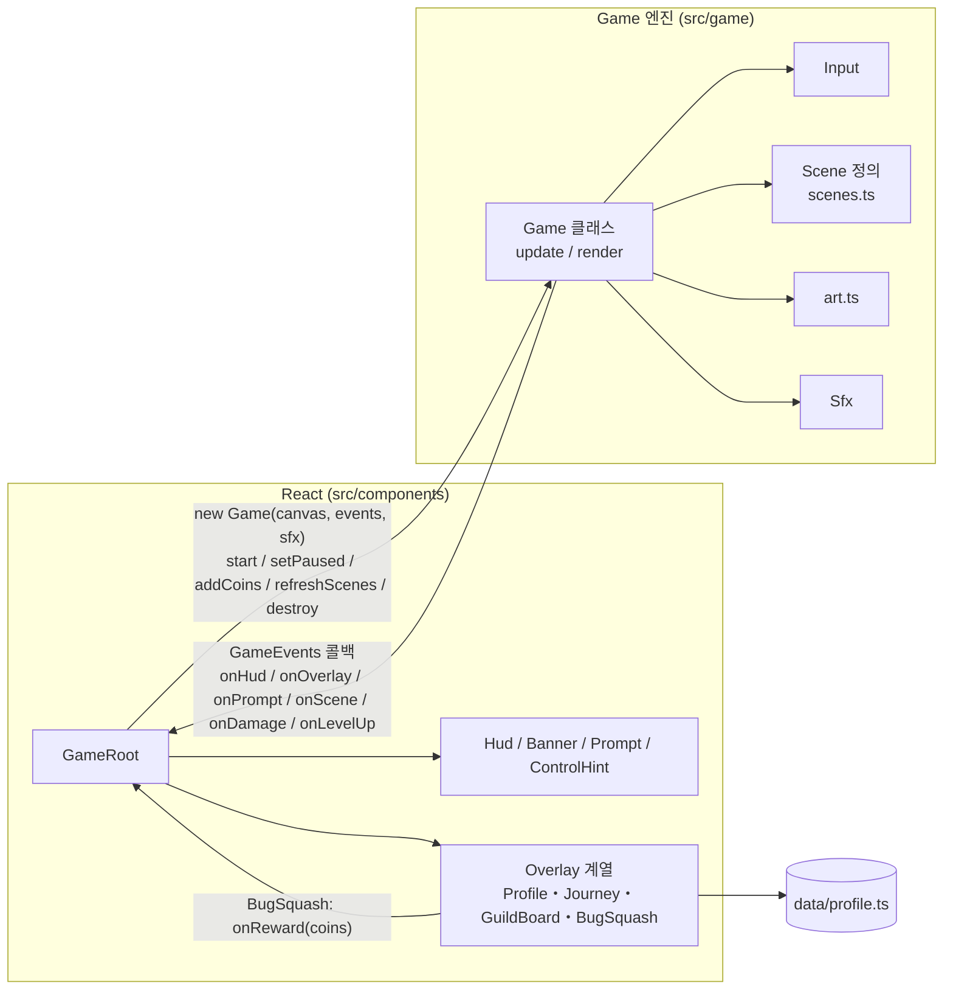

# 02. 기본 설계서

## 1. 기술 스택

| 분류 | 사용 기술 | 버전(package.json) | 용도 |
|---|---|---|---|
| 프레임워크 | Next.js (App Router, Turbopack) | ^16.4.0 | 라우팅/빌드. 실질적으로 `/` 한 페이지 |
| UI | React | ^19.3.0 | 오버레이·HUD 등 UI |
| 언어 | TypeScript | ^7.0.2 | 전체 (`strict: true`) |
| 스타일 | Tailwind CSS (+ `@tailwindcss/postcss`) | ^4.3.3 | UI 스타일 + 자체 CSS(`globals.css`) |
| 애니메이션 | GSAP | ^3.15.0 | UI 연출, 화면 전환, **게임 루프(`gsap.ticker`)** |
| 게임 | HTML Canvas 2D (자체 구현) | — | 월드 렌더링·물리·전투 |
| 사운드 | Web Audio API (자체 구현) | — | 효과음·BGM 합성 |
| 폰트 | Galmuri 2.40.3 (자체 호스팅, SIL OFL 1.1) | — | 도트 폰트. `public/fonts/` 의 woff2 2종(Galmuri9 / Galmuri11) |

## 2. 디렉터리 구성

```
introduction-game/
├─ docs/                       … 본 문서
├─ src/
│  ├─ app/
│  │  ├─ layout.tsx            … <html lang="ko">, 메타데이터
│  │  ├─ page.tsx              … <GameRoot /> 만 렌더링
│  │  └─ globals.css           … Tailwind + 도트 UI 클래스(.px-box .px-btn .pxl-* 등)
│  ├─ components/              … React UI (오버레이/HUD)
│  │  ├─ GameRoot.tsx          … ★ 엔진 생성·UI 상태·오버레이 라우팅
│  │  ├─ Hud.tsx               … 체력/레벨/경험치/코인/소리/도움말
│  │  ├─ ControlHint.tsx       … 우하단 조작 가이드 (조작하면 페이드아웃) + CONTROLS 상수
│  │  ├─ TouchControls.tsx     … 터치 기기용 버튼
│  │  ├─ Overlay.tsx           … 공통 창(열림/닫힘 애니메이션, Esc)
│  │  ├─ ProfilePanel.tsx      … STATUS / SKILLS 탭
│  │  ├─ JourneyMap.tsx        … 발자취 지도
│  │  ├─ GuildBoard.tsx        … 퀘스트 게시판
│  │  ├─ QuestShots.tsx        … 퀘스트 이미지 갤러리/확대 (ShotView, ShotGallery)
│  │  ├─ BugSquash.tsx         … 미니게임
│  │  ├─ HeroAvatar.tsx        … 프로필용 캐릭터 (엔진의 drawHero 재사용)
│  │  └─ PixelArt.tsx          … 문자 그리드 → SVG 도트 아이콘 + 팔레트
│  ├─ game/                    … 게임 엔진 (React 비의존)
│  │  ├─ engine.ts             … Game 클래스 (루프·물리·전투·씬 전환·렌더)
│  │  ├─ scenes.ts             … 4개 씬 정의와 배경 렌더링
│  │  ├─ art.ts                … 스프라이트·이펙트 그리기 (주인공/슬라임/코인 등)
│  │  ├─ input.ts              … 키보드/터치 입력
│  │  ├─ audio.ts              … Sfx (효과음/BGM)
│  │  └─ types.ts              … 공용 타입·상수(VIEW_W/H)
│  └─ data/
│     └─ profile.ts            … ★ 소개 콘텐츠 (프로필·스킬·경력·퀘스트)
├─ public/                     … (현재 없음. 퀘스트 스크린샷을 둘 곳: public/quests/)
├─ next.config.mjs / postcss.config.mjs / tsconfig.json / package.json
```

## 3. 아키텍처

### 3.1 전체 구조

게임 로직은 React 밖의 `Game` 클래스에 두고, React는 **UI(HUD·오버레이)와 엔진의 수명 관리**만 맡는다.



### 3.2 게임 루프

- `gsap.ticker.add(tick)` 로 매 프레임 호출한다 (`requestAnimationFrame` 직접 사용 없음).
- `dt = min(deltaMs / 1000, 1/30)` — 탭 비활성 후 복귀 시 급격한 이동을 막기 위해 상한을 둔다.
- 1프레임의 흐름: `update(dt)` (일시정지 중이면 생략) → `render()` → `input.endFrame()`.
- `update`/`render` 중 예외가 나면 `console.error`에 기록하고 캔버스에 오류 문구를 표시한다 (원인 파악용).
- 적을 타격하면 `hitstop`(약 0.05초)으로 정지 연출, 피격/타격 시 `shake`로 화면 흔들림.

### 3.3 일시정지와 오버레이

1. 인터랙터블(책장·지도·책상·게시판·게임기)에서 ↑ → 엔진이 `setPaused(true)` 후 `onOverlay(id)` 호출.
2. `GameRoot`가 `open` 상태를 바꿔 해당 오버레이를 렌더링.
3. 닫으면 `GameRoot.closeOverlay()` → `setOpen(null)` + `setPaused(false)`.
4. 재개 직후 **0.4초간 ↑ 입력을 무시**한다 (`interactLock`). 닫을 때 남은 ↑ 입력으로 EXIT 문에 들어가는 오작동을 막기 위함.

### 3.4 렌더링 구조

| 항목 | 내용 |
|---|---|
| 논리 해상도 | 480×270 (`VIEW_W` × `VIEW_H`). CSS로 확대, `image-rendering: pixelated` |
| 컨테이너 | `aspect-ratio: 480/270`, 폭 `min(100vw, 100dvh×16/9)` |
| 배경 | 씬별 **오프스크린 캔버스에 1회 그려 캐시** (지연 생성). 매 프레임은 `drawImage`로 합성 |
| 시차 | 마을: 하늘(고정) → 원경 산(×0.12) → 언덕·소나무(×0.4) → 근경(×1.0) |
| 동적 요소 | 구름·새·횃불·모니터·네온 등은 매 프레임 그린다 |
| 그리기 순서 | 씬 배경 → 인터랙터블 화살표 → 코인 → 적 → 플레이어(+참격) → 파티클 → 데미지 숫자 → 전환(원형 와이프) |
| 스프라이트 | 이미지 파일 없이 `fillRect` 중심으로 코드에서 그림 (`art.ts`) |
| 카메라 | `cam += (target - cam) × min(1, dt×8)`. 실내(폭 480)는 고정 |
| 폰트 대응 | 폰트는 기다리지 않고 시작한다. 캔버스 전용인 Galmuri9는 `document.fonts.load` 로 명시적으로 읽기 시작하고, 도착하면(`loadingdone`) `refreshScenes()` 로 배경 캐시를 다시 만든다 (게임 상태 유지) |

### 3.5 씬 전환

`transition(cb)`: GSAP로 `fade.v` 를 0→1 (0.45초) → 콜백(`setScene`) → 1→0 (0.55초). 전환 중에는 `locked=true`로 입력을 무시한다. 와이프의 중심은 플레이어 위치, 반지름은 6px 단계로 양자화해 도트 느낌을 낸다. KO 부활에도 같은 전환을 쓴다.

## 4. 모듈 책임

### 4.1 `Game` (engine.ts) 공개 API

| 메서드 | 설명 |
|---|---|
| `new Game(canvas, events, sfx)` | 캔버스 크기를 480×270으로 설정 |
| `start()` | 입력 등록·마을 씬 설정·루프 시작 |
| `destroy()` | 루프 해제·입력 해제·BGM 정지 |
| `setPaused(v)` | 일시정지 (입력도 비활성화). 해제 시 `interactLock=0.4` |
| `addCoins(n)` | 코인 가산 (BugSquash 보상용) |
| `refreshScenes()` | 배경 캐시 재생성 |
| `getHud()` | 현재 HUD 상태 |
| `input` / `sfx` | 터치 입력용 / 효과음 |

### 4.2 `GameEvents` (엔진 → React)

| 이벤트 | 용도 |
|---|---|
| `onHud(HudState)` | 체력·코인·레벨·경험치 갱신 |
| `onOverlay(OverlayId)` | 오버레이 열기 (`profile / skills / journey / board / bugs`) |
| `onPrompt(label \| null)` | 화면 하단 "↑ 라벨" 표시 |
| `onScene(id, title)` | 씬 배너 표시. 홈 최초 진입 시 프로필 자동 오픈 |
| `onDamage()` | 하트 흔들림 |
| `onLevelUp(level)` | "LEVEL UP!" 배너 |

### 4.3 React 쪽 상태 (`GameRoot`)

| 상태 | 의미 |
|---|---|
| `ready` / `started` | 엔진 생성 완료 / 시작 완료 (현재는 준비되면 바로 시작) |
| `open` | 열린 오버레이 (`OverlayId \| "help" \| null`) |
| `hud`, `prompt`, `banner`, `damageTick`, `muted`, `touch`, `hint` | HUD·표시 제어 |
| `seenHome` (ref) | 홈 최초 진입 여부 (새로고침 시 초기화) |

### 4.4 GSAP 사용처

| 대상 | 연출 |
|---|---|
| 게임 루프 | `gsap.ticker` |
| 씬 전환 | 원형 와이프 트윈 |
| Overlay | 열림(scale+back.out)/닫힘, 배경 페이드 |
| ProfilePanel | 항목 순차 등장, 능력치 바 `steps(16)`, 타이프라이터 |
| JourneyMap | 타임라인: 구간 이동 → 발자국 pop → 지점 elastic 등장 + 링 확산 |
| GuildBoard | 종이 낙하(bounce.out)·핀, 호버, 클릭 시 종이→중앙 확대(좌표 보간) |
| QuestShots | 이미지 슬라이드, 확대 창 |
| BugSquash | 벌레 출현/타격 찌그러짐, 점수 팝업, 시간 바, 카운트다운 |
| HUD/배너/프롬프트 | 하트 흔들림, 코인 팝, EXP 바(`steps(8)`), 배너 슬라이드 |
| ControlHint | 페이드 인/아웃 |

### 4.5 사운드 (`audio.ts`)

- Web Audio로 **파일 없이 합성**: 효과음 11종(`jump attack hit kill coin hurt enter levelup select squash bomb`).
- BGM: 테마 2종 `outdoor`(마을, 128bpm) / `indoor`(실내, 88bpm). 스텝 시퀀서(`setInterval`).
- 브라우저 정책상 **첫 키 입력/클릭 시** `AudioContext`를 초기화하고 BGM을 시작한다 (`GameRoot`의 unlock 리스너).
- 음소거는 마스터 게인으로 제어.

### 4.6 입력 (`input.ts`)

`held`(누르는 중)와 `edge`(이번 프레임에 눌림) 두 집합. `enabled=false`(일시정지)이면 키 이벤트를 무시하고 `preventDefault`도 하지 않는다. 키 → 동작 매핑은 [04 게임 사양서](04-game-spec.md) 참조. 창 포커스를 잃으면(`blur`) 입력을 비운다.

## 5. 스타일 설계

- 도트 UI용 자체 클래스: `.px-box` / `.px-btn` (큰 창·버튼), `.pxl-box` / `.pxl-btn` / `.pxl-bar` (HUD, 각진 계단형 테두리), `.parchment` / `.wood` (양피지·나무 질감), `.blink`.
- 월드 그래픽은 4px 블록 단위·윤곽선 없는 단색을 원칙으로 한다.
- `prefers-reduced-motion: reduce` 에서 `.blink` 애니메이션과 버튼 transition을 끈다.

## 6. 빌드·설정

| 파일 | 내용 |
|---|---|
| `next.config.mjs` | `reactStrictMode: true` |
| `postcss.config.mjs` | `@tailwindcss/postcss` |
| `tsconfig.json` | `strict`, `moduleResolution: bundler`, 경로 별칭 `@/* → ./src/*` |
| 스크립트 | `dev` / `build` / `start` / `lint`(= `tsc --noEmit`) |

## 7. 설계상의 주요 판단

| 판단 | 이유 |
|---|---|
| 게임 로직을 React 밖 클래스로 분리 | 60fps 루프에서 React 재렌더링 비용을 피하고, UI와 책임을 나누기 위해 |
| 이미지/음원 에셋 없음 | 도트 스타일을 코드로 통일하고, 외부 의존·로딩 대기를 없애기 위해 |
| 배경을 오프스크린 캐시 | 매 프레임 수백 번의 `fillRect`를 피하기 위해 |
| 루프에 `gsap.ticker` 사용 | GSAP 트윈과 같은 시계로 동기화하기 위해 |
| 폰트를 기다리지 않음 | 즉시 시작하기 위해 (도착하면 배경만 재생성) |
| 폰트를 자체 호스팅 | 외부 CDN 의존(버전 변동·무결성 검증 불가 등 공급망 위험)을 없애기 위해. 파일은 npm 공식 해시와 대조해 검증 후 배치 |
| 진행 상황을 저장하지 않음 | 서버·저장소 없이 정적으로 운영하기 위해 (BUG SQUASH 최고 기록만 예외) |
